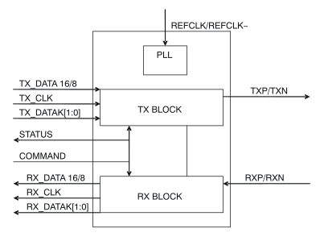
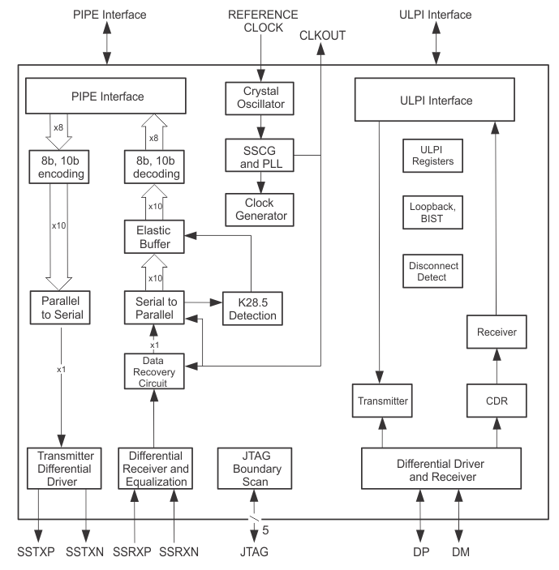

<!-- $theme: default -->

PCI Express, Sata, USB 3.0
===

Robin Gonzalez, CARNET
Boanerges Martinez, CARNET
Emilio Rojas, B15680

---

Estudio de Mercado
===

Se busca un dispositivo para __PCIe__ y uno de __USB 3__ comerciales de los fabricantes:
- Texas Instruments
- NXP

---
     
 

---

### [XIO1100 x1 PCI Express PHY](http://www.ti.com/product/XIO1100)

- __Precio:__ $5.25 por unidad al comprar 1000 unidades.
- __Diagrama de bloques:__

---
### [XIO1100 x1 PCI Express PHY](http://www.ti.com/product/XIO1100)
  - __Frecuencia:__ De la hoja del fabricante: 
  >fIN–DIFF
  >Differential input frequency
  >REFCLK+
  >REFCLK−
  >100 MHz The input frequency is 100 MHz + 300 ppm and
  >− 2800 ppm including SSC–dictated variations.
  
  - __Potencia:__ La hoja del fabricante no indica consumo de potencia(unidades W), sin embargo indica consumo de potencia bajo. Tres modos de potencia P0, P0s y P1.

---

### [TUSB1310A USB 3.0 Transceiver](http://www.ti.com/product/TUSB1310A)
- __Precio:__ $9.60 por unidad al comprar 1000 unidades.
- __Diagrama de bloques:__
!

---
### [TUSB1310A USB 3.0 Transceiver](http://www.ti.com/product/TUSB1310A)
  - __Frecuencia:__ 
 
  
  - __Potencia:__ 
---

 
 
---

### [PX1011B: PCI Express stand-alone X1 PHY](https://www.nxp.com/products/interfaces/pci-express/pci-express-stand-alone-x1-phy:PX1011B)

- __Precio:__ $6.88 por unidad al comprar 1000 unidades.
- __Diagrama de Bloques:__

  

---

### [PX1011B: PCI Express stand-alone X1 PHY](https://www.nxp.com/products/interfaces/pci-express/pci-express-stand-alone-x1-phy:PX1011B)

- __Frecuencia:__ De la hoja del fabricante: 
   > fclk(ref) 
   > reference clock frequency 
   > min:99.97 MHz
   > typ:100 MHz
   > max:100.03 MHz

- __Potencia:__ De la hoja del fabricante:

  > Power management
    - Dissipates < 300 mW in L0 normal mode
    - Support power management of L0, L0s and L1

---

# Conclusiones del Estudio de Mercado

---

# División Propuesta del Trabajo

 
 - __Robin__: Implementación Paralelo-Serial.
 
 - __Boanerges y Emilio__: Revisión de bloque 8b/10b, posible inicio de implementación.
