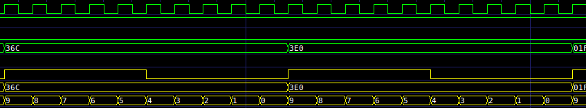
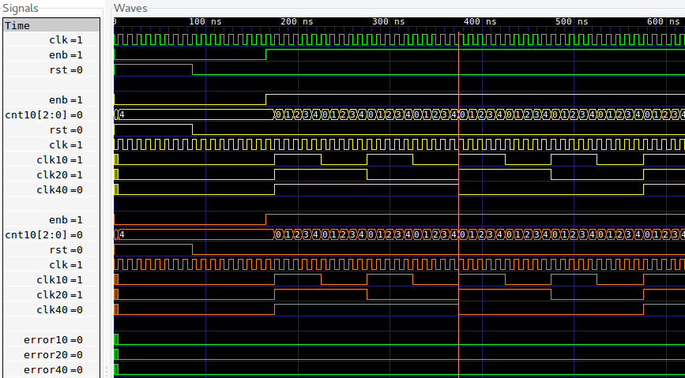
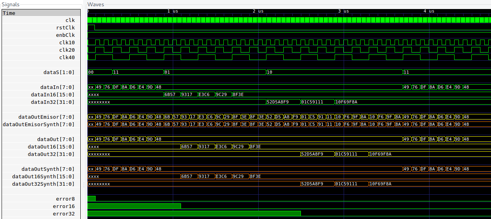
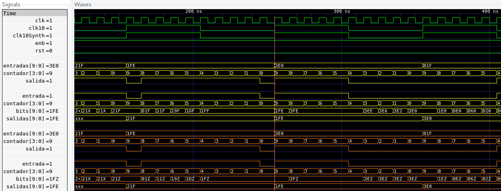
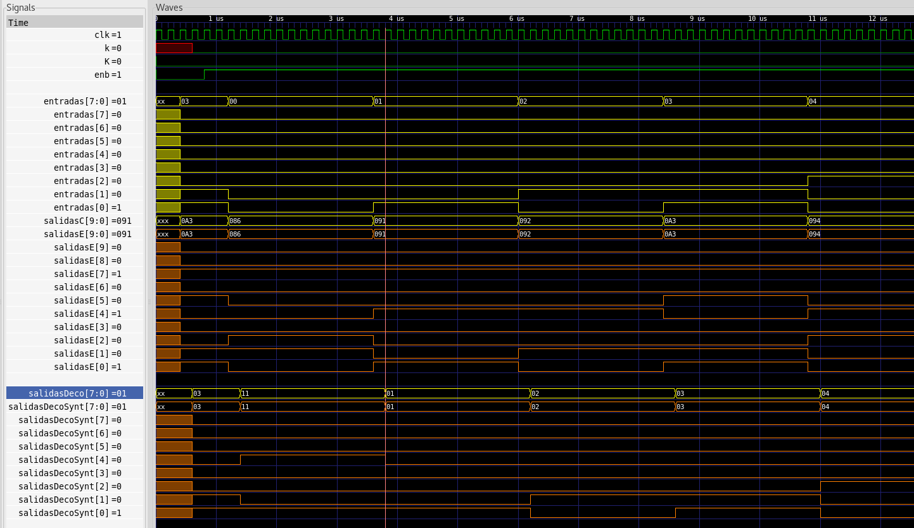
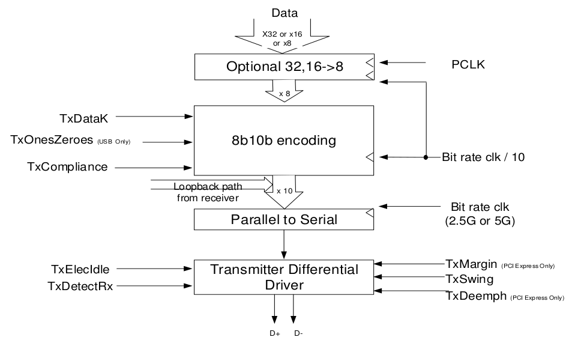
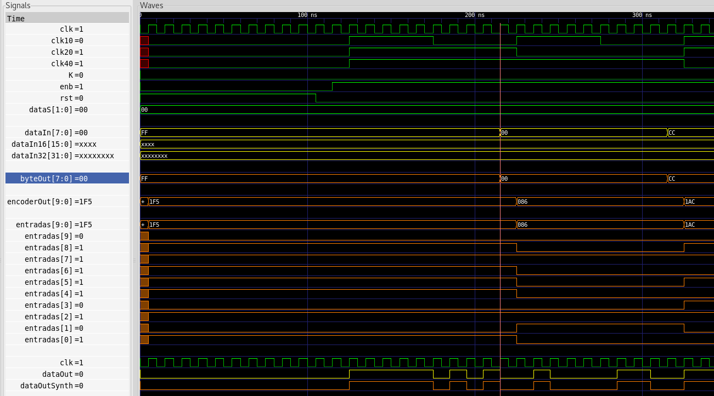
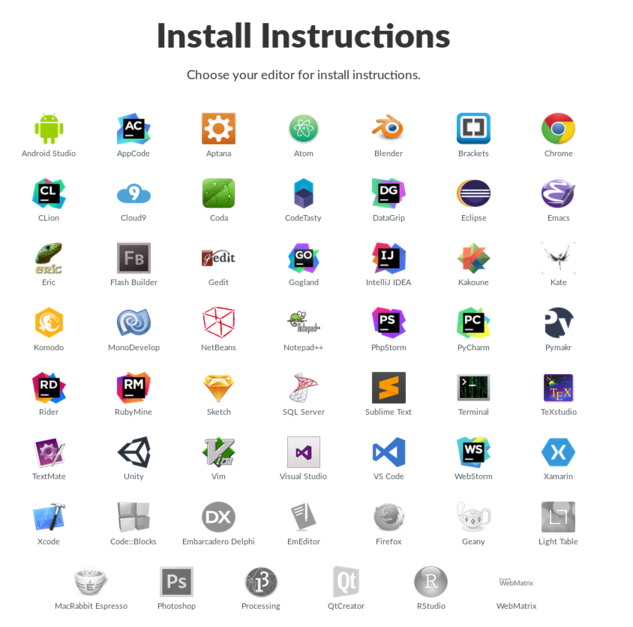

# Avance de Bloques
## Conductuales y Estructurales
### ```paraleloSerial```, ```serialParalelo```, ```to8bit```, ```from8bit```, ```encoder```, ```decoder```, ```clks```
_Por_
#### Robin Gonzalez
#### Boanerges Martinez
#### Emilio Rojas

---
# ```Makefile```
```Makefile
DIRS  = build pdfs
CC    = iverilog
CC1   = vvp
CC2   = gtkwave
CC3   = yosys -c # yosys con bandera para tcl

# para instalaciones locales(carpeta con .vpi's)
VPI   = -M ~/ruta/instalacion/lib/ivl

# crea folders necesarios en caso que no existan
MAKE_FOLDERS := $(shell mkdir -p $(DIRS))

# correr siempre
# evita 'nothing to be done for `target`'
.PHONY: compile synth run
```

---
```Makefile
# Sintetiza, compila y corre
all: synth compile run

synth: synthYosys renameSynths
# Sintetiza segun scripts de yosys dentro de
# las carpetas para los bloques
synthYosys:
  $(foreach vlog,$(wildcard ./bloques/**/*.v),
  VLOG_FILE_NAME=$(vlog)
  VLOG_MODULE_NAME=$(subst .v,,$(notdir $(vlog)))
  CUR_DIR=$(shell pwd) $(CC3) ./yosys.tcl;)
  rm -f ./pdfs/*.dot
# Renombrar modulos sintetizados
renameSynths:
  bash ./renameSynths.sh

# Compila con iverilog
compile:
  $(foreach test,$(wildcard pruebas/*.v),
  cd pruebas;
  $(CC) -o
  ../build/$(subst pruebas/,,$(subst .v,.o,$(test)))
  $(subst pruebas/,,$(test)) -Ttyp -g specify;
  cd ..;)
```

---
```Makefile
run:
  $(foreach test,$(wildcard build/*.o),
  $(CC1) $(VPI) $(test);)

# Uso:
# > make gtkw="./achivo.gtkw" view
# Resulta más sencillo utilizar simplemente
# > gtkwave ./archivo.gtkw
view:
  gtkwave $(gtkw)

clean:
  rm -r build
  rm -r pdfs
  rm -f ./*.dot
  rm -f tests/*.vcd
```

---
# ```yosys.tcl```
```bash
yosys -import

set curDir         "$::env(CUR_DIR)"
set vlogModuleName "$::env(VLOG_MODULE_NAME)"
set vlogFileName   "$::env(VLOG_FILE_NAME)"

yosys read_verilog $vlogFileName

hierarchy -check -top $vlogModuleName
show -prefix pdfs/$vlogModuleName-original \
     -format pdf -colors 3 -viewer echo
...
write_verilog ./build/$vlogModuleName-sintetizado.v
```
---

# ```renameSynth.sh```
```bash
cd build
# para todos los archivos que terminen en
# '-sintetizado.v' en la carpeta 'build'
for file in ./*-sintetizado.v; do
  # elimina './'
  moduleName=${file/.\//}

  # elimina '-sintetizado.v'
  # se tiene nombre del modulo
  moduleName=${moduleName/-sintetizado.v/}

  # nombre del modulo sintetizado
  newModuleName=${moduleName}Synth

  # busca nombre del modulo y remplaza por nombre del
  # modulo sintetizado
  sed -i \
  "s/module ${moduleName}/module  ${newModuleName}/" \
  "${file}"
done
```
---

# Sintesis de Bloques
### Correcta temporizacion


_De ```gtkws/testParaleloSerial.gtkw```_

### Asignaciones no bloqueantes

```verilog
...
@ (posedge clk10); entradas <= 10'h36c;
@ (posedge clk10); entradas <= 10'h3e0;
@ (posedge clk10); entradas <= 10'h01f;
...
```
_Extracto de ```pruebas/testParaleloSerial.v```_

---

# Bloque ```clks```
```verilog
module clks(clk, rst, enb,        // entradas
            clk10, clk20, clk40); // salidas
```
```verilog
always @ (posedge clk) begin
  if (rst) begin
    cnt10 <= 3'd4; // contador
    clk10 <= 1'b0; clk20 <= 1'b0; clk40 <= 1'b0;
  end else begin
    if (enb) begin
      if (cnt10 >= 3'd4) begin
        cnt10 <= 3'd0;
        clk10 <= ~clk10;
        if (~clk10) clk20 <= ~clk20;
        if (~clk20 & ~clk10) clk40 <= ~clk40;
      end else begin
        cnt10 <= cnt10 + 1'b1;
      end
    end
  end
end
```

---
# Bloque ```clks```

 - Se comporta igual de manera conductual y estructuralmente.
 - Permite tener mismas senales de entrada a bloques conductuales y estructurales para las pruebas.


_De ```gtkws/testClks.gtkw```_

---
# Bloque ```to8bit```
```verilog
// convierte una senal seleccionada por dataS de n 
// a 8 bits segun sea el caso.
module to8bit(rst, enb, clk,
  clk16, clk32, dataIn, dataIn16, dataIn32, dataS,
  dataOut);
```
 - A partir de el selector de datos ```dataS``` y un contador se obtiene la salida.
 - Se usa un contador ascendente para salidas de 16 y 32 bits, de acuerdo a esto se seleccionan los bits de la entrada que salen.
 - Salida de 8 bits es la entrada.

---

# Bloque ```to8bit```
#### Las salidas se definen en un bloque combinacional
```verilog
always @ ( * ) begin
  if (dataS == 2'b01) begin
    dataOut = contador == 0 ? 
              dataIn16[15:8] : dataIn16[7:0];
  end else if (dataS==2'b10) begin
    if (contador==0) dataOut = dataIn32[31:24];
    else if(contador==2'b01) dataOut = dataIn32[23:16];
    else if(contador==2'b10) dataOut = dataIn32[15:8];
    else dataOut = dataIn32[7:0]; 
  end else begin
    dataOut = dataIn;
  end
end
```

---

# Bloque ```to8bit```
#### El contador funciona como el estado, se asigna de acuerdo al ```dataS``` y el valor de contador anterior
```verilog
  always @ (posedge clk) begin
    if (dataS == 2'b01) begin
      contador <= contador >= 2'b01 ? 0 : contador+1;
    end else if (dataS ==2'b10) begin
      contador <= contador >= 2'b11 ? 0 : contador+1;
    end else begin
      contador <= 0;
    end
  end
```
---

# Bloque ```from8bit```
```verilog
// convierte una señal seleccionada por dataS de 8 a 
// n bits segun sea el caso.
module from8bit(rst, enb, clk, 
  clk8, clk16, clk32, dataIn, dataS,
  dataOut, dataOut16, dataOut32);
```


---
# Bloque ```from8bit```
```verilog
always @ ( * ) begin
  if (dataS == 2'b01 && dataSInternal) begin
    dataOut = outBits8;
    dataOut16 = outBits16;
    dataOut32 = outBits32;
  end else if (dataS == 2'b10 && dataSInternal) begin
    dataOut = outBits8;
    dataOut16 = outBits16;
    dataOut32 = outBits32;
  end else begin
    dataOut = (dataS == 2'b00 || dataS == 2'b11) ? 
              dataIn : outBits8;
    dataOut16 = outBits16;
    dataOut32 = outBits32;
  end
end
```


---

# Bloque ```from8bit```
```verilog
always @ (posedge clk8) begin
  if (rst) begin
    bits <= 0; contador <= 0; 
  end 
  if (~rst && enb) begin
    outBits8  <= ...
    outBits16 <= ...
    outBits32 <= dataSInternal && dataS == 2'b10 ?
                 {bits[31:8], dataIn} : outBits32;
    if (dataS == 2'b01) begin
      ...
    end else if (dataS == 2'b10) begin
      contador <= (contador>=2'b11)?'b00:contador+1;
      dataSInternal <= (contador == 2'b10) ? 1 : 0;
      if (contador == 2'b00) bits[31:24] <= dataIn;
      ...
      else bits[7:0] <= dataIn;
    end else begin ... end
  end
end // always @ (posedge clk8)
```

---

# ```to8bit``` y ```from8bit```


_De ```gtkws/testTo8bitFrom8bit.v```
_Tambien se tienen pruebas individuales de cada modulo_


---

# Bloque ```paraleloSerial```

```verilog
// Este modulo se encarga de serializar una
// entrada paralela cada n ciclos de reloj
module paraleloSerial(clk, rst, enb, clk10, entradas,
                      salida);
```
 - Estado definido por un contador.
 - La salida es tomada directamente de la entrada:
   ```verilog
   always @(*) begin
     // operador ternario se asegura de usar
     // todos los casos, senal 0 constante no
     // es esperada, ver 8b10b
     salida = ~rst & enb ? entradas[contador] : 0;
   end
   ```
---
# Bloque ```paraleloSerial```
 - Orden de contador es descendente, se devuelve el MSB primero.
 - Se actualiza estado en flanco positivo de reloj:
 ```verilog
always @(posedge clk) begin
  // Cuando rst esta encendido se
  // asigna 0 al contador para comenzar con 9
  // inmediatamente se de el flanco positivo
  if (rst) begin
    contador <= 0;
  end else begin
    contador <= contador == 0 ?
                cantidadBits-1 : contador-1;
  end
end
 ```
 ---
# Bloque ```serialParalelo```
```verilog
// Este modulo se encarga de escuchar n bits
// en n ciclos de reloj, y enviarlos una vez
// que se han adquirido los n bits.
module serialParalelo(clk, rst, enb, clk10, entrada,
                      salidas);
```
 - Se actualiza la salida cada 10 flancos de reloj ```clk```.
 - La salida es secuencial.
 - Se guardan valores en un arreglo de 10 bits que pasa a la salida una vez que se han capturado los 10 bits.
 - Se identifica que se han capturado 10 bits con el uso de un contador.

---
# Bloque ```serialParalelo```
```verilog
always @(posedge clk) begin
  if (rst) begin
    contador <= 0;
  end else if (enb) begin
    contador <= contador==0? cantidadBits-1:contador-1;
    bits[contador] <= entrada;
    if (contador ==  0) begin
      salidas <= {bits[cantidadBits-1:1], entrada};
    end
  end
end
```
 - ```rst``` se asigna a 0 para que siguiente número sea 9(contador descendente).
 - Primer bit que se escucha es el MSB.
 - Se cambia la salida cuando el contador llega a 0.
 - El bit 0 de la salida pasa directo de la entrada, porque no se ha almacenado _aun_.
---
# ```paraleloSerial``` y ```serialParalelo```


_De ```gtkws/testParaleloSerialSerialParalelo.gtkw```_
_Tambien se tienen pruebas individuales de cada modulo_

---


# Bloque ```encoder```
```verilog
module encoder(	//8 to 10 bit encoder
	entradas,
	salidas,
	K,
	clk,
	enb,
	);

	input wire [7:0] entradas;
	input wire clk, K, enb;
	output reg [9:0] salidas;
	reg j, h, g, f, i, e, d, c, b, a;
	reg L03, L30, L12, L21;
```
 - Lógica combinacional para calculo de salidas.
 - Codificación de 3 a 4 bits y de 5 a 6 bits.
 - Bits añadidos son el i y el j.
---

# Bloque ```decoder```
```verilog
//Asignacion sincrona de la salida
always @(posedge clk) begin
        data8_out[7] <= H;
        data8_out[6] <= G;
        data8_out[5] <= F;
        data8_out[4] <= E;
        data8_out[3] <= D;
        data8_out[2] <= C;
        data8_out[1] <= B;
        data8_out[0] <= A;
        k_out <= K;
        invalid_value <= PINVBY;
end
```
 - Recibe datos de 10 bits serialParalelo y decodifica a 8 bits
 - Algunos valores posibles son invalidos en la codificacion.
 - Mayoritariamente logica combinacional, bloque de FF para obtener salida sincronizada de reloj.
---


# ```encoder``` y ```decoder```


_De ```gtkws/testEncoderDecoder.gtkw```_
_Tambien se tienen pruebas individuales de cada modulo_

---

# Bloque ```transmisor```

_De ```phy-interface-pci-express-sata-usb30-architectures-3.1```_

---

# Bloque ```transmisor```

_De ```gtkws/testTransmisor.gtkw```_

---

# ```Herramientas utiles```

_De ```wakatime.com```_
---