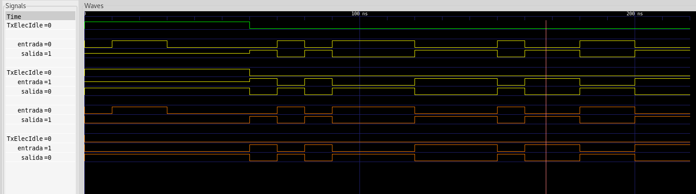
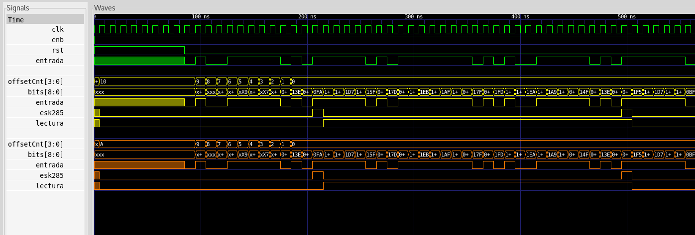
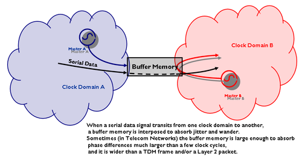
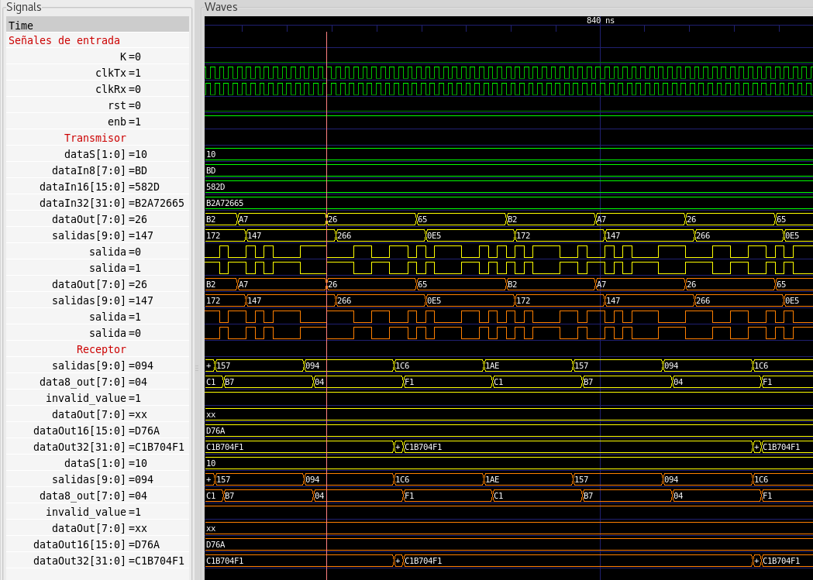

# Capa fisica de la interfaz PCIE USB 3.0
## Demostracion de funcionamiento de descripcion estructural
_Por_
#### Robin Gonzalez
#### Boanerges Martinez
#### Emilio Rojas

---
# ```Modulos```
### Emisor
###  ```clks```,```to8bit```, ```encoder```, ```paraleloSerial``` 
### Receptor
###  ```serialParalelo```, ```decoder```, ```from8bit```, ```sincronizador``` ,```detectorK28.5```

---

# Transmisor
### Diagrama de bloques


---
# Recibidor
### Diagrama de bloques


---

# Bloque ```Diferencial```


- Dos diferentes: emisor y receptor.
- Codificación NRZ-L
- Lógica combinacional
- Señales de potencia en desuso
---

# Bloque ```Sincronizador```
```verilog
always @ ( posedge clkRx ) begin
  if (rst) begin
    flop1 <= 1'b0;
    dataSync <= 1'b0;
  end else begin
    flop1 <= dataAsync;
    dataSync <= flop1;
  end
end

```
- Recibe bits asíncronos del diferencial, los transmite con el reloj local


---

# Bloque ```Detector K28.5```


- Detecta la secuencia de entrada k28.5 : 001111_1010
- Al llegar k28.5 activa la salida lectura que funciona como enable para bloques restantes
---


# Investigacion ```Elastic buffer```




---


# Bloque Emisor 


---

# Bloque Receptor 


---


# Interfaz, conexion de emisor y receptor 




---

# Calculo de potencia

```verilog
module DFF(C, D, Q);

always @(posedge C)	Q <= D; 
//Codigo de intrumentacion para el conteo de transiciones
//utilizando la directiva del compilador
`ifdef CALCULOPOTENCIA
  always @(posedge Q) testbench_P1.probador.m1.PwrCntr[0]
  <=testbench_P1.probador.m1.PwrCntr[0]+1;
`endif
endmodule

```

 - Modulo de memoria de contadores
 - Cada modulo con su contador
 
---


# Interfaz con retardos
```verilog
module NOT(A, Y);
parameter tpdmin = 0.094;
parameter tpdtyp = 0.094;
parameter tpdmax = 0.080;
input A;
output Y;
 assign #(tpdmin:tpdtyp:tpdmax) Y = ~A;
endmodule
```
- Retardos añadidos a biblioteca cmos
---

# Cantidad de Compuertas

## Transmisor con submódulos
```
ABC RESULTS:              NAND cells:       38
ABC RESULTS:               NOR cells:      110
ABC RESULTS:               NOT cells:       29
ABC RESULTS:        internal signals:       65
ABC RESULTS:           input signals:       60
ABC RESULTS:          output signals:       10

`\clks'.
`\diferencialEmisor'.
`\encoder'.
`\paraleloSerial'.
`\to8bit'.
`\transmisor'.
```

---
# Cantidad de Compuertas

## Recibidor con submódulos
```
ABC RESULTS:               NOR cells:        2
ABC RESULTS:               NOT cells:        2
ABC RESULTS:        internal signals:        1
ABC RESULTS:           input signals:        3
ABC RESULTS:          output signals:        2

`\clksReceptor'.
`\decoder'.
`\diferencialReceptor'.
`\from8bit'.
`\k285Detector'.
`\recibidor'.
`\serialParalelo'.
`\sincronizador'.
```