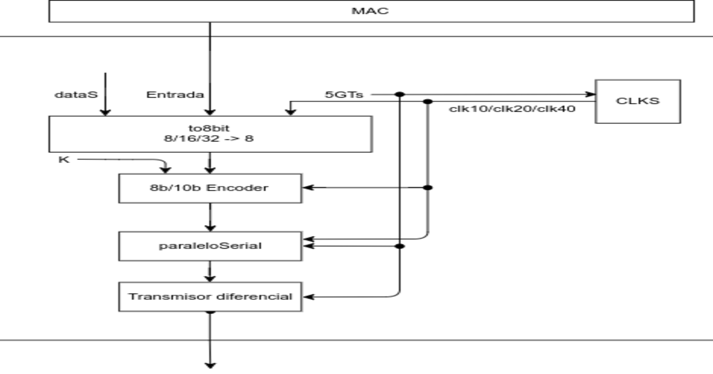
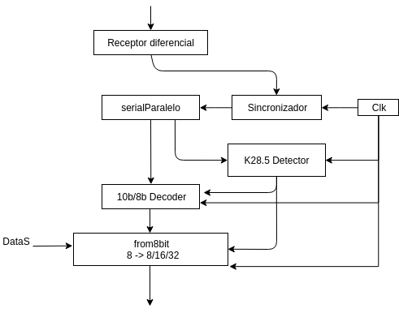
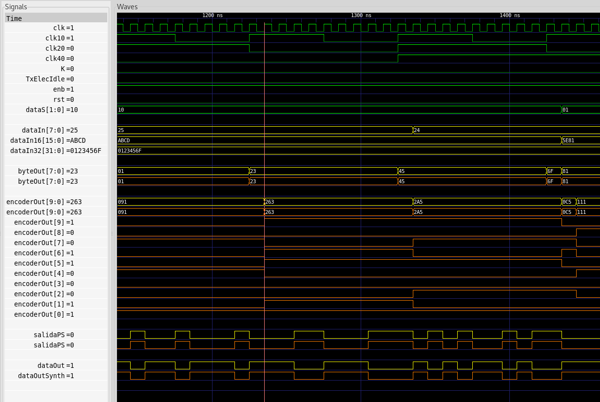
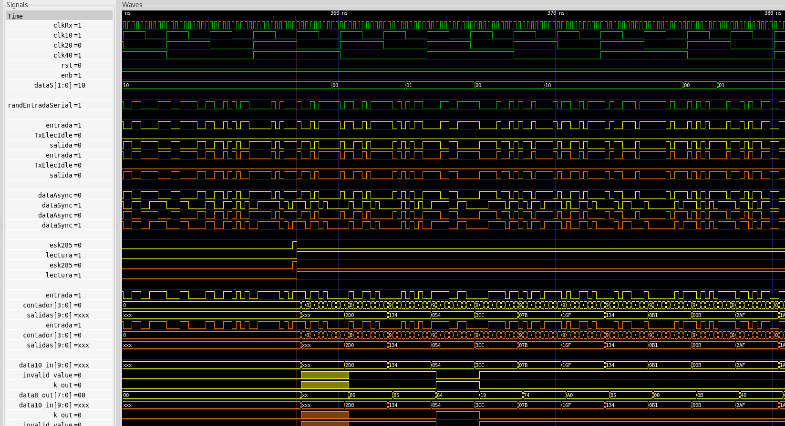

# Capa fiica de la interfaz PCIE USB 3.0
## Demostracion de funcionamiento de descripcion estructural
_Por_
#### Robin Gonzalez
#### Boanerges Martinez
#### Emilio Rojas

---
# ```Modulos```
### Emisor
###  ```clks```,```to8bit```, ```encoder```, ```paraleloSerial``` 
### Receptor
###  ```serialParalelo```, ```decoder```, ```from8bit```, ```sincronizador``` ,```detectorK28.5```

---

# Transmisor
### Diagrama de bloques


---
# Recibidor
### Diagrama de bloques


---

# Modulos nuevos
### Detector K28.5


---

# Modulos nuevos
### Sincronizador


---


# Modulos nuevos
### Diferencial


---

# Investigacion ```Elastic buffer```
---


# Emisor 

---

# Receptor 

---


# Interfaz, conexion de emisor y receptor 

---

# Interfaz con retardos

---
